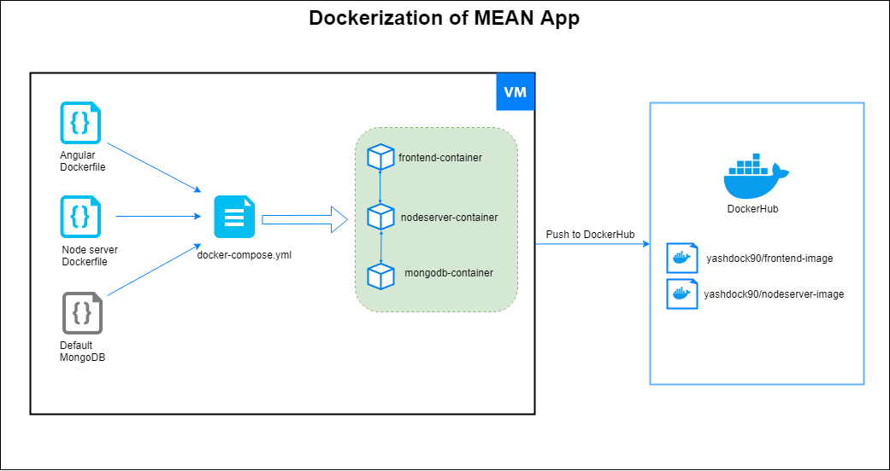
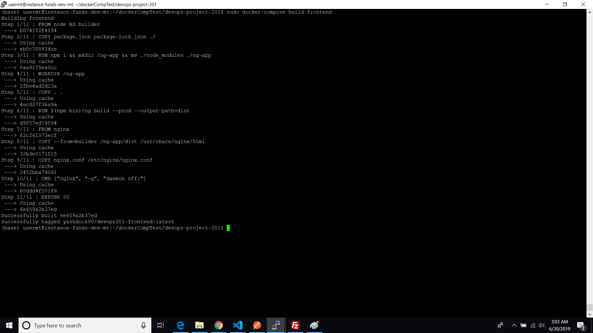
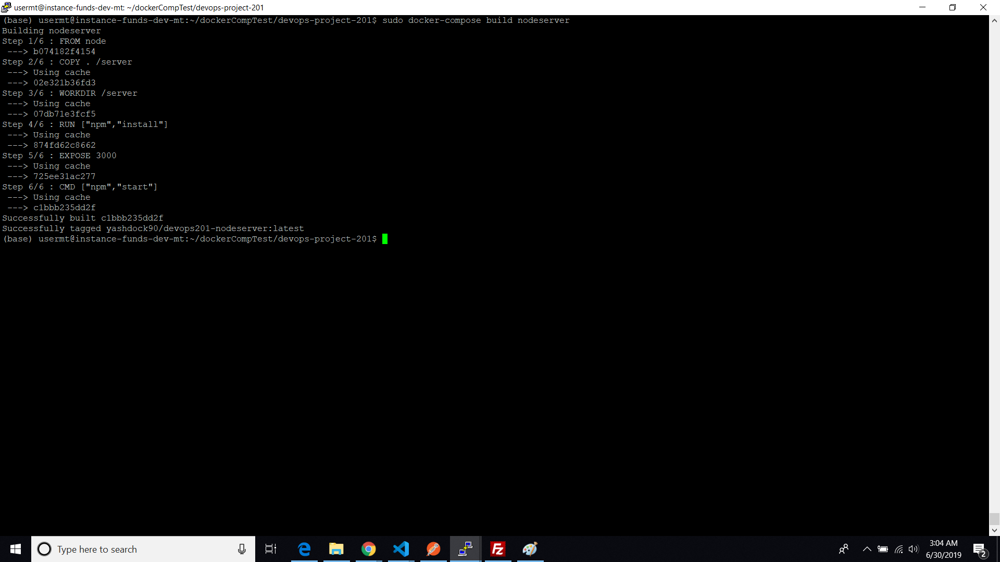
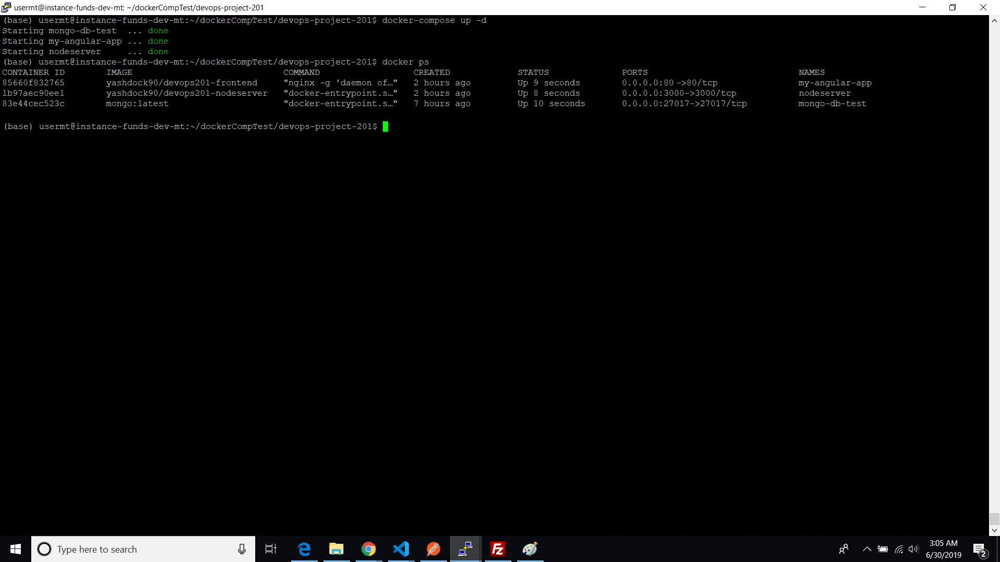
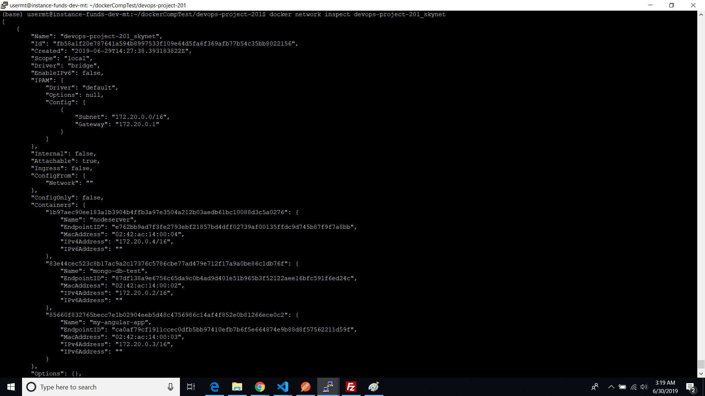
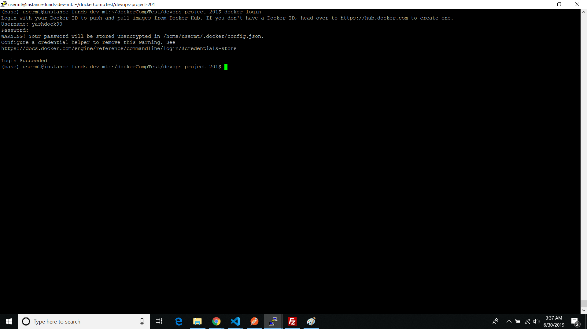
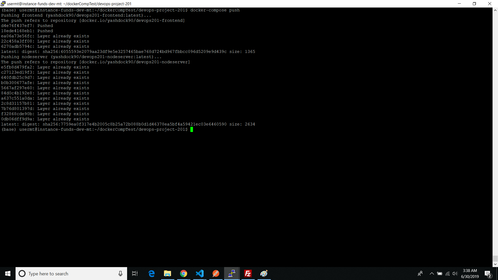
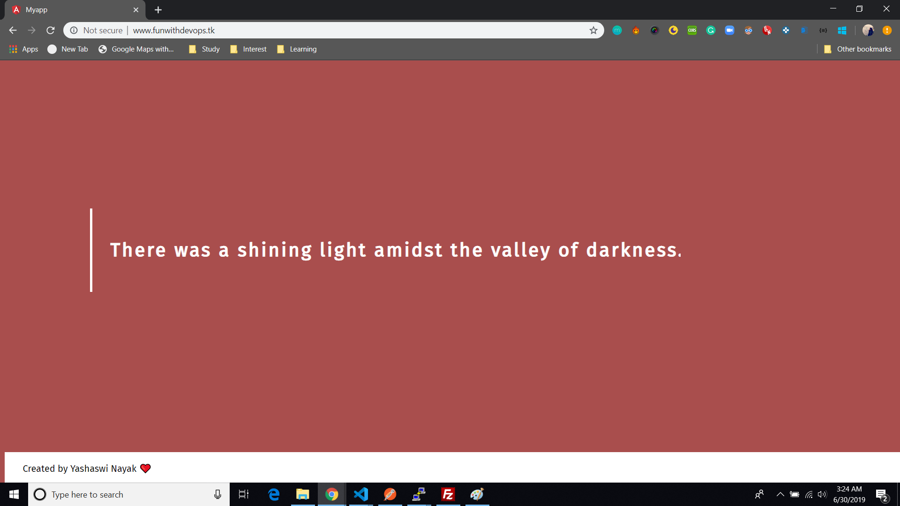

## Dockerization of Angular(MEAN) App
Yashaswi Nayak

---

I have done the following given processes for deploying the Dockerized MEAN App.

The source code can be found on [Github Repo](https://github.com/YashaswiNayak99/devops-project-201)

I have deployed the app on server. Visit the site [here](http://www.funwithdevops.tk)

- [Dockerization of Angular(MEAN) App](#Dockerization-of-AngularMEAN-App)
  - [Docker + Docker Compose Installation](#Docker--Docker-Compose-Installation)
  - [Angular(MEAN) App Setup](#AngularMEAN-App-Setup)
  - [Deployment and Demo](#Deployment-and-Demo)

We will be using `Ubuntu 18.04 VM` for the process.
___

### Docker + Docker Compose Installation

1.  We will install Docker CE, follow the below steps for installing.
    
    ```$ sudo apt update```

    ```$ sudo apt install apt-transport-https ca-certificates curl software-properties-common```

    ```$ curl -fsSL https://download.docker.com/linux/ubuntu/gpg | sudo apt-key add - ```

    ```$ sudo add-apt-repository "deb [arch=amd64] https://download.docker.com/linux/ubuntu bionic stable" ```

    ```$ sudo apt update ```

    ```$ apt-cache policy docker-ce ```

    ```$ sudo apt install docker-ce ```

    Verify the installation by running

    ```$ sudo systemctl status docker ```

2.  We will use Docker Compose 1.21.2, Fetch it from the repo using the command

    ```$ sudo curl -L https://github.com/docker/compose/releases/download/1.21.2/docker-compose-'uname -s'-'uname -m' -o /usr/local/bin/docker-compose```
3. Set permission for compose, using following command
    
    ```$ sudo chmod +x /usr/local/bin/docker-compose```
4. Verify installation using command
   
   ```$ docker-compose --version```

   For detailed reference, visit [here](https://www.digitalocean.com/community/tutorials/how-to-install-and-use-docker-on-ubuntu-18-04) for Docker and [here](https://www.digitalocean.com/community/tutorials/how-to-install-and-use-docker-on-ubuntu-18-04) for Docker Compose

___

### Angular(MEAN) App Setup

The MEAN App has frontend(Angular App), backend(Node server) and database(MongoDB) components.

We have seperate Dockerfile for Angular and Node components. For MongoDB we use a default image from DockerHub. 



We have a Github Code repo where our application code is stored. You can view the repo [here](https://github.com/YashaswiNayak99/devops-project-201)

1. In Angular Application we build the app and deploy it using Nginx server.

    ```docker
    FROM node AS builder

    COPY package.json package-lock.json ./
    RUN npm i && mkdir /ng-app && mv ./node_modules ./ng-app
    WORKDIR /ng-app
    COPY . .
    RUN $(npm bin)/ng build --prod --output-path=dist


    FROM nginx
    COPY --from=builder /ng-app/dist /usr/share/nginx/html
    COPY nginx.conf /etc/nginx/nginx.conf
    CMD ["nginx", "-g", "daemon off;"]
    EXPOSE 80
    ```

    We have a multi step Dockerfile
    - Using node image we build the angular app with production settings.
    - After build we package it and serve it in the nginx server.

2. In our repo we have a `/server` folder where we keep the node server files. 
    ```docker
    FROM node
        
    COPY . /server
    WORKDIR /server

    RUN ["npm","install"]
    EXPOSE 3000
    CMD ["npm","start"]
    ```
    Dockerizing the node server is a straight forward process, as specified in the Dockerfile.

3. We build both the frontend and backend using `docker-compose.yml` file
   
    ```docker-compose
    version: '3'
    services:

    frontend:
        build: ./
        container_name: my-angular-app
        image: yashdock90/devops201-frontend
        ports:
        - '51008:80'
        networks: 
        - skynet

    nodeserver:
        build: ./server/
        container_name: nodeserver
        image: yashdock90/devops201-nodeserver
        expose:
        - 3000
        ports:
        - '3000:3000'
        links:
        - database
        networks: 
        - skynet
      
    database:
        image: mongo:latest
        container_name: mongo-db-test
        volumes:
        - ./data/db:/data/db
        ports:
        - 27017:27017
        networks: 
        - skynet
    
    networks:
    skynet: {}
    ```
    As shown above, we have 3 services 
    - frontend - This builds the Angular app which will be built from the first Dockerfile
    - nodeserver - This builds the Node server using the second Dockerfile
    - database - This will pull the default mongodb image from DockerHub
    
    We also have defined a common network (skynet) which will be created across the services for communication between containers.

    The images will be built and tagged using my DockerHub username (yashdock90)
___

### Deployment and Demo

Deployment of the code was done in an AWS instance (Ubuntu 18.04)

1. Cloned the code from Github, entered the directory.
2. Ran the following command for building the images

    ```$ sudo docker-compose build frontend```

    ```$ sudo docker-compose build nodeserver```





3. Once the images are built. We start the services using the command

    ```$ sudo docker-compose up -d```



4. We can check the networks created by using command
    
    ```$ docker network list```

5. We can verify the whether containers are on same network, using the command

    ```$ docker network inspect <network-name>```



6. To push the images to DockerHub, we have to login using the DockerHub account.

    ```$ docker login```



7. To push the images to DockerHub account, use the command
   
    ```$ docker-compose push ```



You can check the images on DockerHub [frontend-image](https://cloud.docker.com/repository/docker/yashdock90/devops201-frontend) and [server-image](https://cloud.docker.com/repository/docker/yashdock90/devops201-nodeserver)

8. Finally we check the website, Navigate on browser to url http://www.funwithdevops.tk 



`Note: I had purchased the AWS Instance and the domain name for personal work, using the same host the devops 201 course work. Hence I have modified the nginx server routing accordingly. If the code has to be deployed on other servers the code in nginx.conf has to changed.`

---
