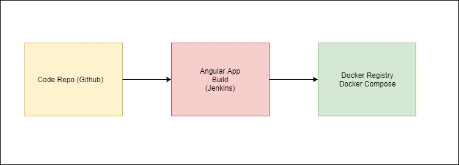
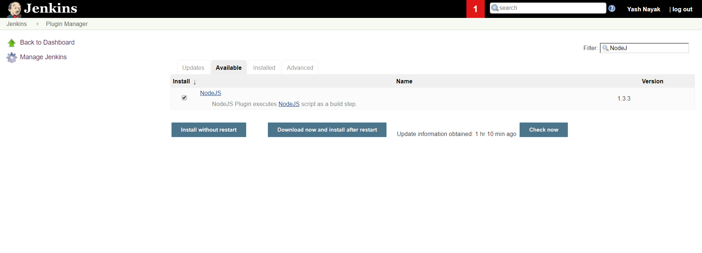
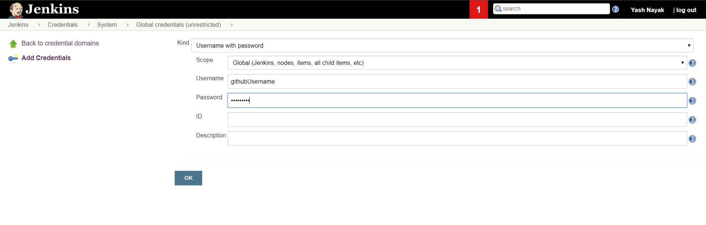
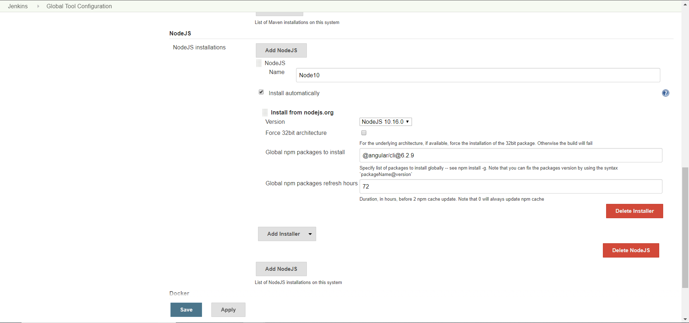

## Dockerization of Angular App
Following steps are to be implemented in order for the dockerization process of angular application.

- [Dockerization of Angular App](#Dockerization-of-Angular-App)
  - [Docker + Docker Compose Installation](#Docker--Docker-Compose-Installation)
  - [Jenkins Installation](#Jenkins-Installation)
  - [Angular App Setup](#Angular-App-Setup)
  - [Jenkins Pipeline Setup](#Jenkins-Pipeline-Setup)
  - [Docker Deployment](#Docker-Deployment)

We will be using `Ubuntu 18.04 VM` for the process.

### Docker + Docker Compose Installation

1.  We will install Docker CE, follow the below steps for installing.
    
    ```$ sudo apt update```

    ```$ sudo apt install apt-transport-https ca-certificates curl software-properties-common```

    ```$ curl -fsSL https://download.docker.com/linux/ubuntu/gpg | sudo apt-key add - ```

    ```$ sudo add-apt-repository "deb [arch=amd64] https://download.docker.com/linux/ubuntu bionic stable" ```

    ```$ sudo apt update ```

    ```$ apt-cache policy docker-ce ```

    ```$ sudo apt install docker-ce ```

    Verify the installation by running

    ```$ sudo systemctl status docker ```

2.  We will use Docker Compose 1.21.2, Fetch it from the repo using the command

    ```$ sudo curl -L https://github.com/docker/compose/releases/download/1.21.2/docker-compose-'uname -s'-'uname -m' -o /usr/local/bin/docker-compose```
3. Set permission for compose, using following command
    
    ```$ sudo chmod +x /usr/local/bin/docker-compose```
4. Verify installation using command
   
   ```$ docker-compose --version```

   For detailed reference, visit [here](https://www.digitalocean.com/community/tutorials/how-to-install-and-use-docker-on-ubuntu-18-04) for Docker and [here](https://www.digitalocean.com/community/tutorials/how-to-install-and-use-docker-on-ubuntu-18-04) for Docker Compose

### Jenkins Installation
Jenkins requires Java 8 to be installed on the system. Install Java 8 using the following command
    
```$ sudo apt install openjdk-8-jdk```

Verify if Java is running

```$ java -version```

Once Java is up and running. Run the following process in order for the Jenkins to be setup

1.  We add the repository key to our system
   
    ```$ wget -q -O - https://pkg.jenkins.io/debian/jenkins.io.key | sudo apt-key add -```

2. Append the package to `source.list` 
    
    ```$ sudo sh -c 'echo deb http://pkg.jenkins.io/debian-stable binary/ > /etc/apt/sources.list.d/jenkins.list'```

3. Update `apt` and instal jenkins

    ```$ sudo apt update```

    ```$ sudo apt install jenkins```
4. Starting Jenkins and Updating Firewall
    
    Staring Jenkins
    
    ```$ sudo systemctl start jenkins```
    
    Verifying if jenkins is running
    
    ```$ sudo systemctl start jenkins```
    
    Allowing the traffic through port `8080`
    
    ```$ sudo ufw allow 8080```
    
    Checking the port status
    
    ```$ sudo ufw status```

5. Setting up Jenkins

    Open `http://your_server_ip_or_domain:8080` in your browser. You will see the following screen first time
    
    

    In your VM terminal run the following command

    ```$ sudo cat /var/lib/jenkins/secrets/initialAdminPassword ```

    Copy the password in the browser and rest of the process is straight forward.

    In next screen select `Install suggested plugins`

    Once the installation is done, create a user with password.

### Angular App Setup

We are following 3 steps in building and managing the angular app.



- We have a Github Code repo where our application code is stored
- We will build the Angular app in Jenkins using Jenkins Pipeline
- Once the App is built, we will Dockerize it in the VM using 

An angular sample application has been created on Github. You can view the repo [here](https://github.com/YashaswiNayak99/devops-project-201)

Once cloned you can change the files and push it to the repo. On admin approval the changes will be integrated into the repo.

We have a Dockerfile. This file allows us to build the docker image and run it in the VM.


### Jenkins Pipeline Setup

The Jenkins Pipeline is built a custom `Jenkinsfile`. Here we specify the stages and step necessary for building the docker image of our angular app.

1. Plugins Installation
    
    Since angular is run by node. we install the necessary plugins in the Jenkins.

    Go to your jenkins url in browser.

    Navigate to the Manage Jenkins > Manage Plugins > Available

    

    Select `Download now and install after restart`

    Jenkins will be restarted after installation.

    Similarly install the plugins
    - Github Integration Plugin
    - Blue Ocean

2. Configurations for Pipeline

    Navigate to Credentials > System > Global credentials (unrestricted) > Add Credentials

     

    Add you Github Account username and password. This should be the same account using which you have created the repo for Angular App

    Once done, we have only a Node Plugin configuration

    Navigate to Manage Jenkins > Global Tool Configuration. Scroll down to NodeJS. Enter the following settings

    


### Docker Deployment